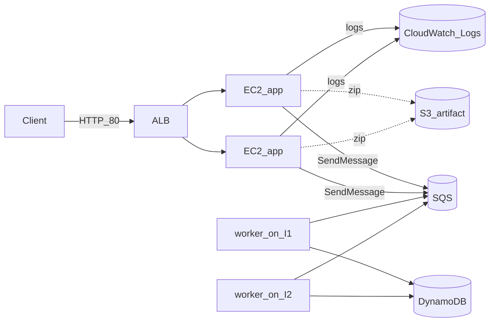

# AWS deploy (Terraform)

**Application Load Balancer (ALB)** + **Auto Scaling Group (ASG)** + **CloudWatch Logs** for the Node app and worker. EC2 instances run in the **default VPC** across **two subnets in different Availability Zones**. Checkout still uses **SQS** and the worker writes to **DynamoDB**; the app zip is still delivered from a **private S3** artifact bucket on first boot.

## S3 caveat (product images vs deployment)

**Product images** live in a **different** S3 bucket: URLs in `data/products.json` point at objects uploaded separately. Terraform does **not** create that bucket.

The **S3 bucket Terraform creates** is **only** for deployment: a private bucket with a **zip** of the repo so new instances can `aws s3 cp` it on first boot.

## SQS and local defaults

Terraform creates **`${var.environment}-orders-queue`** and sets **`ORDERS_QUEUE_URL`** on each instance (`/etc/sysconfig/primecart`).

In **`app.js`** and **`worker.js`**, if `ORDERS_QUEUE_URL` is unset locally, the code can fall back to a hard-coded default queue. **Deployed EC2** always gets the queue in **your** account.

## What Terraform creates

| Resource | Purpose |
| -------- | ------- |
| **ALB** + **listener :80** + **target group** | Internet traffic to healthy instances; health check **`GET /health`** |
| **ASG** + **launch template** | Amazon Linux 2023, `bootstrap.sh` user-data, **desired/min/max** configurable |
| **`aws_security_group.alb`** | Inbound **TCP 80** from `0.0.0.0/0` |
| **`aws_security_group.app`** | Inbound **TCP 80** from the ALB security group only; optional **22** from `ssh_ingress_cidrs` |
| **`aws_dynamodb_table.orders`** | Table **`${var.environment}-orders`**, on-demand, key **`orderId`** |
| **`aws_sqs_queue.orders`** | Standard queue **`${var.environment}-orders-queue`** |
| **S3 artifact bucket + object** | Private zip at `releases/app.zip` |
| **IAM role + instance profile** | Artifact read, DynamoDB, SQS, **CloudWatch Logs** (`PutLogEvents` on the two log groups), **SSM** |
| **`aws_cloudwatch_log_group`** ×2 | **`/${environment}/primecart-app`** and **`.../primecart-worker`** (stdout via file + agent) |
| **Metric alarms** (no SNS) | **UnHealthyHostCount** on the target group; **CPUUtilization** on the ASG (for load demos) |

Instance metadata: **IMDSv2 required**.

**Subnets:** The ALB and ASG need **at least two subnets in two different AZs**. The module prefers subnets with **`map_public_ip_on_launch`** so instances can reach the internet for bootstrap and the CloudWatch agent without a NAT gateway.

## Application logs (CloudWatch)

Each instance writes **`primecart.service`** / **`primecart-worker.service`** stdout to **`/var/log/primecart/*.log`**. The **Amazon CloudWatch agent** tails those files into the log groups above. In the console: **CloudWatch → Log groups →** pick **`/primecart/primecart-app`** (or your `environment` prefix). Log streams are named **`{instance-id}/app`** and **`.../worker`**.

## EC2 console “Connect” (SSH vs Session Manager)

By default, **SSH (22)** is not open. **Session Manager** works once the SSM agent registers (IAM already includes **`AmazonSSMManagedInstanceCore`**). Pick an instance in the ASG → **Connect → Session Manager**.

To open **SSH** from your IP, set `ssh_ingress_cidrs` in `terraform.tfvars` and apply again.

## What is still not in Terraform

- **Product image** bucket (catalog URLs only).
- **NAT Gateway** (not used; instances rely on public subnets + public IPs for outbound).
- **SNS** or **PagerDuty** for alarms (alarms exist for console / demo charts only).

## Runtime vs first boot

- **Shoppers:** browser → **ALB DNS** on **HTTP** → Express; **`POST /orders`** → **SQS**; **`worker.js`** on each instance → **DynamoDB**.
- **First boot (per instance):** user-data runs **`bootstrap.sh`** → `dnf` → S3 zip → `npm ci` → systemd → CloudWatch agent.

Cold start on **`t2.micro`** can take **many minutes** before **`/health`** returns 200; the ASG **`health_check_grace_period`** defaults to **600** seconds to match that.

## Diagram



## Requirements

- [Terraform](https://developer.hashicorp.com/terraform/install) **>= 1.5** (for `lifecycle` `precondition` on the ASG).
- AWS credentials.
- **Default VPC** with subnets in **at least two AZs** (normal for `default` VPC).

## Configuration

Copy `terraform.tfvars.example` to `terraform.tfvars` and set `aws_region`, `environment`, `instance_type`, optional **`ssh_ingress_cidrs`**, and optional **ASG** / **log** / **alarm** tunables:

| Variable | Default | Notes |
| -------- | ------- | ----- |
| `asg_min_size` | 2 | Minimum healthy capacity |
| `asg_max_size` | 6 | Ceiling for scale-out |
| `asg_desired_capacity` | 2 | Must be between min and max |
| `asg_health_check_grace_period` | 600 | Seconds before ELB health counts |
| `asg_instance_warmup` | 300 | ASG instance refresh warmup |
| `log_retention_days` | 14 | Both log groups |
| `asg_cpu_alarm_threshold` | 50 | Average CPU % for demo alarm |

## Apply / destroy

```bash
cd deploy/terraform
terraform init
terraform apply
```

### If `app_url` never loads

1. **Wait** for bootstrap on **all** instances, then:

```bash
cd deploy/terraform
curl -sS -m 10 "$(terraform output -raw app_url)/health"
```

2. **Target group** in the EC2/ELB console: **Registered targets** should become **healthy**.

3. **Logs:** open the **`cloudwatch_log_group_app`** output in CloudWatch Logs; look for install or runtime errors.

4. **Console output** for a specific instance (replace `INSTANCE_ID` from the ASG in the console):

```bash
aws ec2 get-console-output --instance-id INSTANCE_ID --latest --output text
```

5. **Rolling refresh** after you change code and re-apply (new zip / bootstrap hash bumps the launch template; the ASG is configured for **instance refresh** on tag and launch template changes):

```bash
aws autoscaling start-instance-refresh \
  --auto-scaling-group-name "$(terraform output -raw autoscaling_group_name)" \
  --preferences '{"MinHealthyPercentage":50,"InstanceWarmup":300}'
```

```bash
cd deploy/terraform
terraform destroy
```

## Outputs

| Output | Meaning |
| ------ | ------- |
| `app_url` | `http://<alb-dns-name>` |
| `alb_dns_name` | Same host without scheme |
| `autoscaling_group_name` | For scaling / instance refresh CLI |
| `cloudwatch_log_group_app` / `cloudwatch_log_group_worker` | Log group names |
| `orders_table_name` | DynamoDB table |
| `orders_queue_url` | SQS URL for local testing |
| `app_artifact_bucket` / `app_artifact_key` | Deployment zip location |

## Demo ideas: fault tolerance and recovery

Use these in a presentation or lab write-up; all are compatible with this stack.

1. **Single unhealthy instance** — In **Session Manager** on one instance, run `systemctl stop primecart.service`. The ALB **stops routing** to it after failed **`/health`** checks; the site stays up on siblings. **CloudWatch alarm** `...-unhealthy-targets` goes to **ALARM**. **Logs** for that instance stop showing new requests while others continue.

2. **Bring it back** — `systemctl start primecart.service`; watch the target return **healthy** and the alarm clear.

3. **Forced replacement** — In the console, **terminate** one instance. The ASG **launches** a replacement; traffic fails over to remaining instances during bootstrap.

4. **Load / CPU** — Run k6 (see repo `tests/k6/`) with `BASE_URL=$(terraform output -raw app_url)`. Raise VUs until the **`...-asg-cpu-high`** alarm fires (tune **`asg_cpu_alarm_threshold`** down for a quicker demo).

5. **Scale out** — Temporarily set **`asg_desired_capacity`** (and **`asg_max_size`** if needed) higher, **`terraform apply`**, and show **more targets** behind the ALB sharing load.

6. **Rolling deploy** — Change app code, **`terraform apply`** so the artifact zip changes; **instance refresh** rolls instances with **minimal healthy 50%** so the site stays partially available.

7. **Deep vs shallow** — The ALB target group intentionally probes **`/health`** only (process responsive). **`/health/deep`** (DynamoDB `DescribeTable`) stays for **manual checks**, scripts, or monitoring: wiring deep checks into the ALB would mark every target unhealthy on shared DB issues, add API load on each probe, and slow failure detection—usually a poor fit for load-balancer routing decisions.

## Cost / free tier notes

- **ALB** has an **hourly** charge plus **LCU** billing; it is usually **more expensive than a single `t2.micro`** for a 24×7 demo. See [ELB pricing](https://aws.amazon.com/elasticloadbalancing/pricing/).
- You now pay for **two** (or more) **EC2** instances at **`asg_desired_capacity`**, not one.
- **CloudWatch Logs** ingest + storage is usually small at demo traffic if retention is short.

When you are done experimenting, run **`terraform destroy`** to tear down the ALB, ASG, and other billable pieces.
