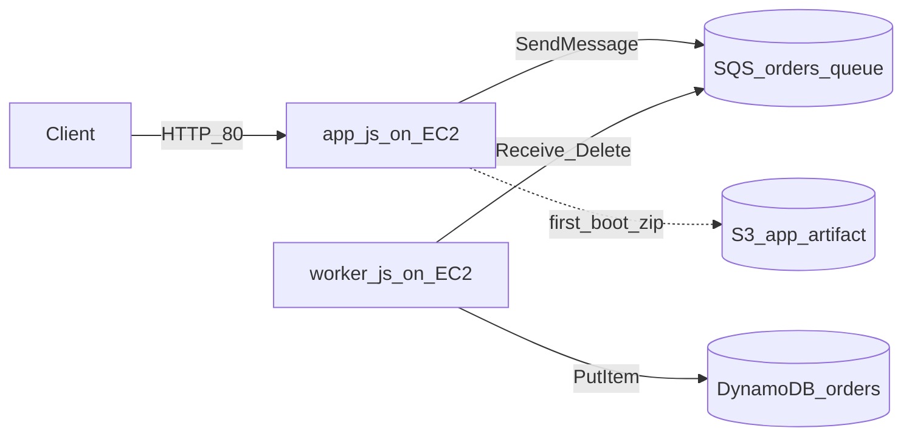

# AWS deploy (Terraform)

Single-instance stack in the **default VPC**: EC2 runs the Node app on **port 80** and a **worker** that drains an **SQS** queue into **DynamoDB**. Checkout enqueues orders to SQS; the worker persists them to the table. On **first boot only**, the instance downloads the app from a **private S3** artifact bucket. There is **no** Application Load Balancer and **no** Auto Scaling Group in this configuration.

## S3 caveat (product images vs deployment)

**Product images** are already stored on a **different** S3 bucket: URLs in `data/products.json` point at objects someone uploaded separately (for example `primecart-images-abdel` in `us-west-1`). Terraform does **not** create or manage that bucket.

The **S3 bucket Terraform creates** is **only** for **automating deployment**: a private bucket holding a **zip of the app** so EC2 can download and unpack it on first boot. Browsers load catalog images from the URLs in `products.json`, not from the Terraform artifact bucket.

## SQS and local defaults

Terraform creates an **`${var.environment}-orders-queue`** SQS queue and writes its URL into **`ORDERS_QUEUE_URL`** on the instance (`/etc/sysconfig/primecart`).

In **`app.js`** and **`worker.js`**, if `ORDERS_QUEUE_URL` is **not** set (typical local run), the code falls back to a **hard-coded default queue URL** in another account. That keeps existing local behavior unchanged. **Deployed EC2** always sets `ORDERS_QUEUE_URL` from Terraform, so the web app and worker use the queue in **your** account.

## What Terraform creates

| Resource | Purpose |
| -------- | ------- |
| `aws_instance.app` | Amazon Linux 2023, Node from user-data (`bootstrap.sh`), systemd units **`primecart.service`** (`app.js`) and **`primecart-worker.service`** (`worker.js`) |
| `aws_security_group.app` | Inbound **TCP 80** from `0.0.0.0/0`; unrestricted egress |
| `aws_dynamodb_table.orders` | Table name **`${var.environment}-orders`** (default `primecart-orders`), billing **PAY_PER_REQUEST**, partition key **`orderId`** (string) |
| `aws_sqs_queue.orders` | Standard queue **`${var.environment}-orders-queue`**; checkout sends messages here; worker consumes and writes to DynamoDB |
| `aws_s3_bucket.app_artifacts` + `aws_s3_object.app_zip` | **Private** bucket; holds **one zip** of the repo (`releases/app.zip`) for EC2 to `aws s3 cp` on boot |
| IAM role + instance profile | **`s3:GetObject`** on that zip only; **`dynamodb:PutItem`** and **`dynamodb:DescribeTable`** on the orders table ARN; **`sqs:SendMessage`**, **`sqs:ReceiveMessage`**, **`sqs:DeleteMessage`**, **`sqs:GetQueueAttributes`** on the orders queue ARN |
| **`AmazonSSMManagedInstanceCore`** (attached) | Lets you use **Session Manager** in the EC2 console without opening port **22** |

Instance metadata: **IMDSv2 required** (`http_tokens = "required"`).

## EC2 console “Connect” (SSH vs Session Manager)

The security group only allows **HTTP (80)** from the internet by default. **SSH (22) is not open**, so **EC2 Instance Connect** (browser SSH) and **SSH to the public IP** fail with “Error establishing SSH connection” until you allow port 22.

**Option A — Session Manager (recommended after `terraform apply`)**  
Terraform attaches **`AmazonSSMManagedInstanceCore`**. In the EC2 console: select the instance → **Connect** → **Session Manager** tab → **Connect**. No SSH key and **no port 22** rule required. If **Session Manager** is greyed out, wait a few minutes for the agent to register, then refresh.

**Option B — Open SSH from your IP**  
Set in `terraform.tfvars` (use your real public IP, e.g. from a “what is my IP” search):

```hcl
ssh_ingress_cidrs = ["YOUR.PUBLIC.IP.ADDRESS/32"]
```

Run **`terraform apply`** again, then use **Connect → EC2 Instance Connect** or your SSH client on port **22**.

## What is not in this Terraform

- **ALB / NLB**, **Auto Scaling Group**, **CloudWatch** dashboards/alarms (not defined here).
- **Product images:** the catalog in `data/products.json` uses **separate** public S3 object URLs. That image bucket is **not** created by this module; only the **deployment zip** bucket is.

## Runtime vs first boot

- **Shoppers:** browser → EC2 public DNS/IP on **HTTP** → Express/EJS; checkout **`POST /orders`** → **SQS**; **`worker.js`** → **DynamoDB**.
- **First boot:** EC2 user-data runs `bootstrap.sh` → **`GetObject`** on the artifact zip → `npm ci` → start **`primecart.service`** and **`primecart-worker.service`**. The app does **not** read product images from the artifact bucket; it uses URLs in `products.json`.

## Diagram



## Requirements

- [Terraform](https://developer.hashicorp.com/terraform/install) installed.
- AWS credentials in the default credential chain (same as `aws` CLI).
- A **default VPC** with at least one subnet. The config prefers a subnet with **`map_public_ip_on_launch` enabled**; otherwise it uses the first default subnet (see `main.tf`).

## Configuration

Optional: copy `terraform.tfvars.example` to `terraform.tfvars` and set `aws_region`, `environment`, `instance_type`, and optionally **`ssh_ingress_cidrs`** if you need browser SSH / port 22 (see **EC2 console “Connect”** above).

On the instance, `/etc/sysconfig/primecart` sets **`AWS_REGION`**, **`ORDERS_TABLE_NAME`** (to the Terraform table name), **`ORDERS_QUEUE_URL`** (to the Terraform queue URL), and **`PORT=80`** so the app matches the provisioned resources (unlike local defaults in `app.js`, which use table name `orders` unless overridden).

## Apply / destroy

```bash
cd deploy/terraform
terraform init
terraform apply
```

Cold start (user-data: install packages, download zip, `npm ci`, start service) often takes **a few minutes** before HTTP responds. On **`t2.micro`**, **`npm ci`** alone can take **10–20+ minutes** of CPU time; until it finishes, **port 80 has no listener**, so the browser may sit on **“loading”** or eventually time out.

### If `app_url` never loads

1. **Wait longer**, then probe (use your `app_url` / public IP from `terraform output`):

```bash
cd deploy/terraform
curl -sS -m 10 "$(terraform output -raw app_url)/health"
```

2. **Read the instance console output** (user-data / bootstrap log). This needs the [AWS CLI](https://docs.aws.amazon.com/cli/latest/userguide/getting-started-install.html) and the same credentials as Terraform:

```bash
cd deploy/terraform
aws ec2 get-console-output \
  --instance-id "$(terraform output -raw instance_id)" \
  --latest \
  --output text
```

Look for errors after `cloud-init` runs the script (failed `dnf`, `aws s3 cp`, `npm ci`, or `systemctl`).

3. In the **EC2 console**, open the instance → **Status checks** and **Monitoring**; if user-data failed, fix the cause then **`terraform apply`** again (changing the zip or bootstrap often **replaces** the instance via `replace_triggered_by`).

```bash
cd deploy/terraform
terraform destroy
```

## Outputs

After `terraform apply`, useful outputs include:

| Output | Meaning |
| ------ | ------- |
| `app_url` | `http://<instance-public-dns>` (port 80) |
| `app_public_ip` | Instance public IPv4 |
| `instance_id` | EC2 id for `get-console-output` / console troubleshooting |
| `orders_table_name` | DynamoDB table name to use for local testing against the same account (with matching credentials) |
| `orders_queue_url` | SQS queue URL; set `ORDERS_QUEUE_URL` locally if you want to use the same queue as the deployed stack |
| `app_artifact_bucket` | S3 bucket containing the deployment zip |
| `app_artifact_key` | Object key (`releases/app.zip`) |

## Cost / free tier

Estimates below match **this repo’s defaults** (`instance_type = t2.micro`, `aws_region = us-west-1` in `terraform.tfvars.example`). They are **rough USD order-of-magnitude** for **on-demand** pricing: AWS changes list prices, your account may have credits, tax, or different regions/types—use the [AWS Pricing Calculator](https://calculator.aws/) before relying on a budget.

### What drives the bill

Almost always **EC2 run hours** plus the **EBS root volume** attached to that instance. This stack has **no ALB** and **no NAT Gateway**, so you avoid those common fixed monthly charges.

### Ballpark (off free tier, instance left running ~24×7)

| Piece | Typical monthly range (USD) | Notes |
| ----- | --------------------------- | ----- |
| **EC2 `t2.micro`** | **~$9–12** | ~730 h/mo × on-demand **~$0.012–0.016/h** in **us-west-1**–class US regions (check [EC2 On-Demand](https://aws.amazon.com/ec2/pricing/on-demand/) for your region and type). |
| **EBS (root disk)** | **~$1–4** | Charged for **allocated GiB** while the volume exists (even if the instance is **stopped**). Size follows the AMI (commonly on the order of **8–30 GiB** for Amazon Linux 2023). See [EBS pricing](https://aws.amazon.com/ebs/pricing/). |
| **DynamoDB** (on-demand table, light traffic) | **~$0–1** | Demo / coursework traffic is usually negligible vs EC2. |
| **S3** (deployment zip + versioning if enabled) | **~$0–0.25** | One small object; occasional full instance refresh downloads. |
| **SQS** (light traffic) | **~$0** | Usually negligible at demo scale. |

**Combined:** about **US$12–18/month** if the instance runs continuously with default-ish settings, with **EC2 + EBS** making up almost all of it. **`t3.micro`** is in a similar ballpark but slightly higher on-demand—override in `terraform.tfvars` and re-check the calculator.

### Free tier and savings

- **EC2 / EBS:** New accounts often get **12 months** of limited free EC2 + EBS; eligibility and caps depend on [AWS Free Tier](https://aws.amazon.com/free/) and your account—confirm in the console. A **`t2.micro`** is the usual free-tier size for that offer when it applies.
- **DynamoDB / S3:** Often within free allowances for this workload; still verify for your account.

### Keeping cost down

- Run **`terraform destroy`** when the environment is not needed (removes EC2 hourly charges and, after the final bill cycle, the EBS volume for that instance).
- **Stop** the instance to avoid EC2 compute charges while experimenting; you still pay for the **EBS** volume until the instance (and its root volume) is terminated.
- Do not upsize `instance_type` unless required; larger types scale cost roughly linearly or faster per vCPU-hour.
