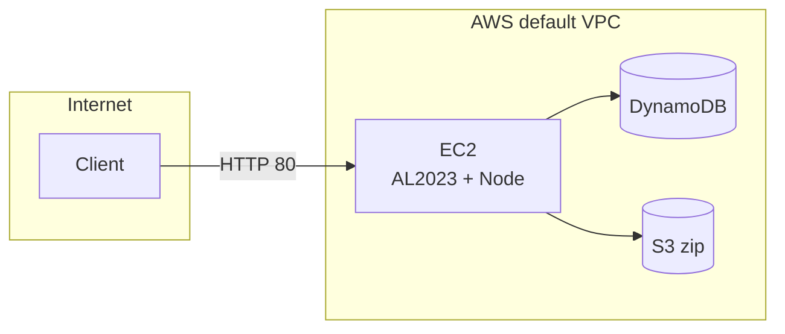

# AWS deploy (Terraform)

Stack: one EC2 (`t2.micro` by default), DynamoDB table for orders, private S3 bucket with a zip the instance downloads on first boot. No ALB.

## Diagram



First boot: S3 `GetObject`, `npm ci`, systemd unit `primecart.service`. App listens on port 80. Traffic path: client → instance public DNS/IP.

## Requirements

- AWS credentials in the default credential chain (same as `aws` CLI).
- Default VPC with a subnet that has `map_public_ip_on_launch` (preferred); otherwise the first default subnet is used.

## Apply / destroy

```bash
cd deploy/terraform
terraform init
terraform apply
```

Outputs include `app_url` and `app_public_ip`. Cold start can take several minutes before HTTP responds.

```bash
cd deploy/terraform
terraform destroy
```

## Cost / Free Tier

EC2 `t2.micro` / `t3.micro` free-tier eligibility depends on account age and AWS terms; see https://aws.amazon.com/free/ . ALB is omitted to avoid its fixed hourly cost. DynamoDB and S3 bill per their pricing when usage exceeds free allowances.
